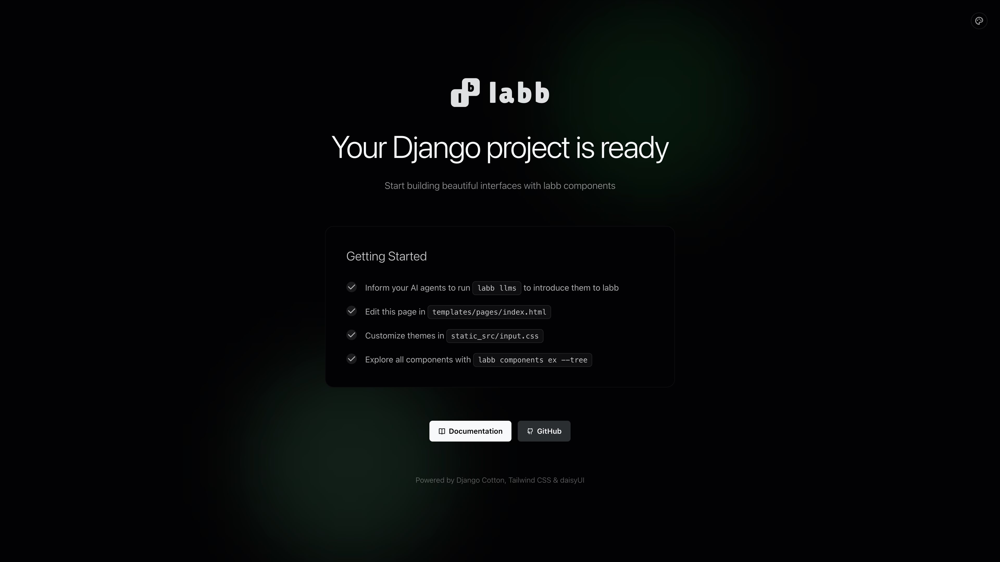

# labb — Django UI Component Library

**labb** is a **Django UI component library** for building modern web interfaces with **django-cotton**, **Tailwind CSS**, and **daisyUI 5**. Pages render server-side with zero JavaScript by default; add **Alpine.js** interactivity on demand via the `.x` variants.

If you want a **django component library** that feels like writing HTML — not a React rewrite of your Django app — labb gives you 70+ production-ready **django ui components** you compose in templates: buttons, forms, modals, charts, navigation, data tables, and more.

> Build Django frontends fast, without a SPA. Server-rendered HTML, themeable design tokens, and composable components — all from your existing Django templates.

## Table of contents

- [Why labb](#why-labb-for-your-django-ui)
- [Installation](#installing-labb-in-your-django-project)
- [Quick start](#quick-start-using-labb-components-in-django-templates)
- [Component catalog](#django-ui-components-included-in-labb)
- [CLI](#labb-cli-for-django-developers)
- [FAQ](#django-component-library-faq)
- [Documentation](#documentation)

## Why labb for your Django UI?

Django templates are powerful, but building a consistent UI means repeating markup on every page. **labb components** feel like native HTML tags (`<c-lb.button>`, `<c-lb.card>`, `<c-lb.modal>`) so you get a coherent design system without leaving Django.

- **Server-side rendering Django**, not an SPA: no virtual DOM, no hydration, no client bundle for the default API.
- **Tailwind CSS and daisyUI 5 under the hood**: themeable with CSS variables, not overridden through class soup.
- **Composable slots**: nest `<c-lb.card.body>`, `<c-lb.modal.action>`, `<c-lb.tabs.content>` the way HTML is meant to be written.
- **Alpine.js on demand**: static by default; opt into reactivity with `.x` variants (e.g. `c-lb.button.x`).
- **Python 3.10 – 3.13**, **Django 4.2+**.

```html
<c-lb.button variant="primary">Save changes</c-lb.button>

<c-lb.card border>
    <c-lb.card.body>
        <c-lb.card.title>Django components, done right</c-lb.card.title>
        <p>Composable, themeable, and fully server-rendered.</p>
        <c-lb.card.actions>
            <c-lb.button variant="primary">Get started</c-lb.button>
        </c-lb.card.actions>
    </c-lb.card.body>
</c-lb.card>

<c-lb.modal id="confirm" withBackdrop withCloseBtn>
    <h3>Are you sure?</h3>
    <p>This action cannot be undone.</p>
    <c-lb.modal.action>
        <c-lb.button variant="error">Delete</c-lb.button>
    </c-lb.modal.action>
</c-lb.modal>
```

## Installing labb in your Django project

The fastest way to start a new Django project with this **django component library** is `labbstart`:

```bash
pip install labbstart
labbstart new myproject
```

This scaffolds a complete Django project with labb, Tailwind CSS, and daisyUI pre-configured and ready to run in one command. It supports Poetry, pip, and uv, and includes a welcome page to get you oriented.

### Adding labb to an existing Django project

```bash
pip install labbui

# With icons (Remix, Heroicons, Lucide, and more)
pip install labbui[icons]
```

Add to your Django settings:

```python
INSTALLED_APPS = [
    "django_cotton",
    "labb",
    # ...
]
```

## Quick start: using labb components in Django templates

### Buttons

```html
<c-lb.button>Default</c-lb.button>
<c-lb.button variant="primary" size="lg">Large primary</c-lb.button>
<c-lb.button variant="error" btnStyle="outline">Delete</c-lb.button>
<c-lb.button as="a" href="/docs">Link styled as button</c-lb.button>
<c-lb.button variant="success" icon="rmx.check-line">Confirm</c-lb.button>
```

### Dropdown

```html
<c-lb.dropdown>
    <c-lb.dropdown.trigger>
        <c-lb.button>Options</c-lb.button>
    </c-lb.dropdown.trigger>
    <c-lb.dropdown.content>
        <c-lb.menu>
            <c-lb.menu.item>Edit</c-lb.menu.item>
            <c-lb.menu.item>Duplicate</c-lb.menu.item>
            <c-lb.menu.item>Archive</c-lb.menu.item>
        </c-lb.menu>
    </c-lb.dropdown.content>
</c-lb.dropdown>
```

### Tabs

```html
<c-lb.tabs variant="bordered">
    <c-lb.tabs.content label="Overview" checked>
        <p>Overview content here.</p>
    </c-lb.tabs.content>
    <c-lb.tabs.content label="Settings">
        <p>Settings content here.</p>
    </c-lb.tabs.content>
</c-lb.tabs>
```

### Alert with icon

```html
<c-lb.alert variant="info" icon="rmx.information-line">
    Your changes have been saved.
</c-lb.alert>
```

## Django UI components included in labb

labb ships with 70+ **Django UI components** across eight categories. Every component is a [django-cotton](https://django-cotton.com/) tag you drop into any Django template.

### Actions
`button`, `dropdown`, `fab`, `modal`, `swap`, `theme-controller`

### Data display
`accordion`, `avatar`, `badge`, `card`, `carousel`, `chat`, `collapse`, `diff`, `hover-gallery`, `hover3d`, `kbd`, `list`, `stat`, `table`, `text`, `text-rotate`, `timeline`

### Navigation
`breadcrumbs`, `dock`, `link`, `menu`, `navbar`, `pagination`, `steps`, `tabs`

### Feedback
`alert`, `loading`, `progress`, `radial-progress`, `skeleton`, `status`, `toast`, `tooltip`

### Data input (Django forms)
`checkbox`, `fieldset`, `file-input`, `filter`, `input`, `label`, `radio`, `range`, `rating`, `select`, `textarea`, `toggle`, `validator`

### Layout
`divider`, `drawer`, `footer`, `hero`, `indicator`, `join`, `mask`, `stack`

### Mockup
`mockup-browser`, `mockup-code`, `mockup-phone`, `mockup-window`

### Charts (Chart.js + daisyUI theming)
`bar`, `bubble`, `doughnut`, `line`, `pie`, `polar-area`, `radar`, `scatter`

Full API references, live examples, and copy-paste snippets for every component: **[labb.io/docs/ui](https://labb.io/docs/ui/)**.

## Features of the labb component library

- **Variant-driven API** — control style through props like `variant`, `size`, and `btnStyle`, not CSS class strings.
- **Composable slots** — nest components naturally with named slots (`<c-lb.card.body>`, `<c-lb.modal.action>`).
- **Server-rendered by default** — no JavaScript runtime, no client bundle, just Django templates and HTML.
- **Optional Alpine.js reactivity** — `.x` variants add client-side behaviour only where you need it.
- **Icon support** — `labbui[icons]` adds multiple icon packs with a single tag (`<c-lbi n="rmx.heart" />`).
- **CLI tooling** — inspect components, search icons, build CSS, and scaffold projects from the terminal.
- **Theme-aware** — daisyUI 5 themes, CSS variables, and dark mode work out of the box.
- **Tested**: 70+ components, production-tested on real Django apps.

## labb CLI for Django developers

labb ships with a CLI for inspecting components, searching icons, and managing your build:

```bash
labb components inspect --list     # List all available components
labb components inspect button -v  # Inspect a component's API
labb components ex button          # View component examples
labb icons search "arrow"          # Search icon packs
labb build -w                      # Watch and build Tailwind/daisyUI CSS
labb init --defaults               # Scaffold a new project
```

## Django component library FAQ

### Does labb work with HTMX?
Yes. labb renders plain HTML, so HTMX swaps drop in without any special configuration. Pair `hx-get` / `hx-post` with any `<c-lb.*>` component.

### Do I need Alpine.js to use labb?
No. The default components are static HTML with CSS. Alpine.js is only loaded when you use `.x` variants (e.g. `c-lb.tabs.x`) or reactive form wire components.

### How is labb different from other Django component libraries?
labb pairs **django-cotton**'s HTML-first syntax with **daisyUI 5**'s themeable design system and **Tailwind CSS** utilities. You get a fully themeable design system instead of a bag of unstyled primitives.

### Can I use labb with my existing Tailwind config?
Yes. labb ships a content path you add to your Tailwind config. Your existing utilities, themes, and customizations keep working.

### Which Django and Python versions are supported?
Python 3.10 – 3.13 and Django 4.2+.

### Is labb production-ready?
Yes. labb is MIT-licensed and used in production Django apps. See **[labb.io](https://labb.io/)** for live examples and case studies.

## Documentation

Browse components, guides, and the blog at **[labb.io](https://labb.io/)** — the official **django ui components** reference for labb, django-cotton, Tailwind CSS, and daisyUI 5.

- Component reference: [labb.io/docs/ui](https://labb.io/docs/ui/)
- Getting started guide: [labb.io/docs/guide](https://labb.io/docs/guide/)
- Blog and tutorials: [labb.io/blog](https://labb.io/blog/)

## Keywords

Django UI components, Django component library, django-cotton, Tailwind CSS Django, daisyUI Django, Alpine.js Django, server-side rendering Django, Django frontend, Python UI library, Django HTMX components, Django design system.

## License

MIT License
